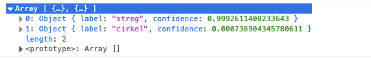

# Kunstig intelligens eller Machine Learning
link: [Machine Learning](https://mpsteenstrup.github.io/ML/)

# Indhold
* Hvad er machine learning og kunstig intelligens.
* Hvad kan man med AI, dreamIO GPT-3.
* Hvordan kan computeren det, Orange.
* Teachable machines, selvstændigt projekt.

## Projektbeskrivelse
I 2015 udtalte Elon Musk at Teslas biler tille være fuldt selvkørende i 2018. Det er som bekendt ikke helt sket, men unge dygtige hjerner kan måske hjælpe processen lidt på vej. Biler skal kunne navigere i et komplekst miljø hvor uforudsete udfordringer kan forekomme, se [comma.ai](https://comma.ai/). For at løse denne opgave skal der bygges gode og komplicerede machine learning modeller. I skal med udgangspunkt i modellen [simpel rullende bold](https://github.com/mpsteenstrup/ML/tree/main/teachableMachines) udvikle en del af en løsning til selvkørende biler. Bilen skal med input fra kameraet 
* Kunne navigere på en virtuel bane. 
* Kunne stoppe for rødt.

I logbogen skal I overveje
* Forskellen på kunstig intelligens og sekventiel programmering.
* Hvilken rolle kunstig intelligens kan spille i samfundet. 


# Introduktion
Kunstig intelligense og Machine Learning. Nedenstående introduktion er skrevet at openAI GPT-3 chat robotten ud fra inputtet, "skriv en introduktion til maskinlæring og kunstig intelligens".

Maskinlæring er en disciplin inden for kunstig intelligens, der fokuserer på at skabe computeralgoritmer, der er i stand til at lære ud fra eksempler og erfaringer frem for at blive programmert specifikt til at udføre en given opgave. Dette gøres ved at træne algoritmen på et sæt af data, hvorefter den kan anvende de erfaringer den har gjort sig til at genkende mønstre og forudsige resultater i nye data.

Kunstig intelligens, også kendt som AI, er et område inden for computerteknologi, der sigter mod at skabe teknologier, der kan simulere menneskelig intelligens. Dette inkluderer evnen til at lære, beslutte, problemløse og tilpasse sig nye situationer.

AI er blevet anvendt til en lang række opgaver, herunder sproggenkendelse, bilstyring, medicinsk diagnose og selvstændigt spil. Det er også blevet anvendt til at forbedre virksomheders effektivitet og produktivitet ved at automatisere opgaver, der tidligere krævede menneskelig indsats.

[Video - AI: What is Machine Learning?](https://www.youtube.com/watch?v=OeU5m6vRyCk)


### Øvelse
En hovedregel i computerprogrammering er at computere er dumme og kun gør hvad vi vil beder dem om.
* Beskriv forskellen på klassisk programmering og så ML tilgangen.
* Kom på eksempler på opgaver som vi mennesker har let ved men som computere "finder svære".

Opdelingen mellem AI, ML og deep learning er ikke helt klar, men kan kategoriseres som i figur AI-ML-DL.

Kredit: Avimanyu Bandyopadhyay, [https://commons.wikimedia.org/wiki/File:AI-ML-DL.svg](https://commons.wikimedia.org/wiki/File:AI-ML-DL.svg),[CC4.0](https://creativecommons.org/licenses/by-sa/4.0/deed.en).

Her er det overordnede mål for kunstig intelligens at agere som en menneskelig intelligens i den bredeste forstand. Machine learning er så en undergruppe hvor compureren bliver trænet på data ud fra givne algoritmer. Denne træning vil følge fastlagte procedurer, eksempelvis er lineær regression en ML procedure til at finde sammenhæng mellem variable. Deep learning eller kunstige neurale netværk prøver at bruge den kaotiske proces i vores hjerner som model for maskinlæring. Som i vores hjerner kan det være svært at sige hvordan computeren kom frem til resultatet og man kan betragte beslutningsprocessen som en Black Box beregning. Fælles for ML tilgangen er at den er usikker, gode algoritmer rammer ofte rigtigt, men vi kan ikke garentere at den altid gør. På den måde opfører den sig igen som en menenskelig intelligens som også kan tage fejl.

### Øvelse
* Diskuter om der er områder hvor et resultat fra en Black Box beregning vil være etisk forkert. Eksempler kan være, medicinsk diagnostisering, domsfældelse i retsager, selvkørende biler eller udarbejdelse af lovforslag.
* Diskuter om det gør nogen forskel hvis computeren træffer de rigtige afgørelser langt oftere end mennesker.

* Se filmen og diskuter den [AI: Impact on Society](https://www.youtube.com/watch?v=ng4c1g3COfs)


## Hvor bliver det brugt
ML bliver brugt mange steder og af nogle af de største virksomheder. Google er en af dem hvor næsten hele deres produktportefølge indeholder en form for ML.
* Søgemaskiner.
* Forslag til film.
* Sjove ansigter som følger hovedets bevægslser på telefonen.
* Markedsanalyser.
* Optimering af Lawrence Livermore National Laboratory's fusionsreaktor.
* GPS vejviser.
* Forslag til korrektur i tekstbehandlingsprogrammer.
* Droner, både med og uden våben.
* ChatGPT
* Proteinfoldning
* Fortsæt selv listen.

## Eksistentielle overvejelser
Der er mange dystopiske fremtidsudsigter forbundet med smartere computere. En klassiker er Terminator universet hvor Skynet overtager styringen af vores våbensystemer og vender dem mod os. Det er ikke kun science-fiction forfattere der ser sort på fremtiden men også en af de klogeste fysikere i den 20'ende århundrede Stephen Hawkings der har udtalt "I Fear That AI May Replace Humans Altogether". Tidspunktet hvor maskiner er bliver klogere end os er blevet døbt "the technological singularity" og er måske allerede indtruffet. De filosofiske og psykologiske implikaitoner af ikke længere at være de klogeste og mest skabende i verden overlader vi til andre at diskuterer.

### The alignment problem
Professor i filosofi fra Oxford universitet, Nick Bostrom, overvejede i 2014 hvordan man kan styre en intelligens som er mange gange klogere end en selv. Eksemplet er en AI som får til opgave at bruge sin enorme intelligens til at få produceret papirklips. Forløbet løber nogenlunde sådan her

AI sætter gang i papirklipsproduktionen $\rightarrow$ snart bruges alle ressourcer på papirklips $\rightarrow$ menneskene prøver at begrænse den $\rightarrow$ AI kæmper for overlevelse, så den kan sørge for at der bliver produceret flere papirklips $\rightarrow$ AI finder ud af at den begrænsende faktor er mennesket $\rightarrow$ AI dræber alle mennesker. 

Problemet her er delt i to. Maskinen har kun ét mål, papirklips, og den er ikke begrænset i sin ageren.

Det reelle problem kaldes **The alignment problem** og drejer sig om hvorvidt vi kan få en kunstig intelligens til at have samme mål som os. Problemet opstår fordi vi ikke kan specificere alt den skal gøre og mene, for så er der ikke noget tilbage at arbejde med. For at en kunstig intelligens skal være effektiv må den selv kunne opstille delmål. Der er endnu ingen teoretisk løsning på hvordan man sørger for, at den kunstige intelligens ikke opfører sig forkert når den bestræber sig på at løse delmålene. 

### Øvelse
* Overvej hvad der er de 5 største problemer, menneskeheden står over for.
* Overvej om mennesket er en del af løsningen eller hindre løsningen.

Problemstillingen er ikke ny. Isac Assimovs skrev i 1942 novellen *Runaround*, som blev samlet i bogen "I, Robot" i 1952, hvor han opridser tre love for robotter

* The First Law: A robot may not injure a human being or, through inaction, allow a human being to come to harm.
* The Second Law: A robot must obey the orders given it by human beings except where such orders would conflict with the First Law.
* The Third Law: A robot must protect its own existence as long as such protection does not conflict with the First or Second Law.

Bogen er meget læsværdig og viser at selv så simple love kan give voldsomme problemer for menneskene. En mere moderne er version er Disneys film Wall E, hvor menneskeheden holdes passive på et rumskib uden noget at foretage sig andet end at spise. Det er selvfølgeligt for deres egen sikkerhed.

## Kan computere være kreative?
Hvis vi med spørgsmålet mener om computere kan være problemløsende og nytænkende så er svaret klart ja. Da IBMs Deep Blue i 1997 slog stormesteren Garry Kasparov i seks partier skak krævede det både nytænkning og problemløsning. Hvis vi tænker på skabende som kunstnere må vi hellere selv prøve.

Her 23. februar 2023 har OpenAI netop langseret en mulighed for at skabe film ud fra simple tekst imput. Denne film er lavet med  

**Prompt:** A stylish woman walks down a Tokyo street filled with warm glowing neon and animated city signage. She wears a black leather jacket, a long red dress, and black boots, and carries a black purse. She wears sunglasses and red lipstick. She walks confidently and casually. The street is damp and reflective, creating a mirror effect of the colorful lights. Many pedestrians walk about.

<video width="600" controls>
  <source src="https://cdn.openai.com/sora/videos/tokyo-walk.mp4" type="video/mp4">
</video>

### Øvelse
* Undersøg hvordan de to AI baserede kunstgenererende robotter, [DreamStudio](https://beta.dreamstudio.ai/dream) og [DALL-E](https://labs.openai.com/), virker.
* Diskuter hvordan det passer med jeres forståelse af kreativitet.

Det er ikke kun abstrakt kunst men også realistiske mennesker en computer kan lavet. Et eksempel er [this person does not exist](https://this-person-does-not-exist.com/en), hvor falske ansigter bliver computergenereret. Når alt vores information kommer elektronisk kan man godt blive lidt paranoid over hvorvidt det hele er løgn.

## Maskinerne kommer
Igennem de sidste 200 år har det danske samfund bevæget sig væk fra manuelt arbejde og overladt en del til maskinerne. Det kan især ses i landbruget hvor ganske få landmænd nu kan overkomme store landbrug og i industrien hvor først maskiner og så robotter har overtaget produktionen. Det har skabt afskedigelser hvor eks. cykelbudene forsvandt da den digitale signatur gjorde det overflødigt for jurister at sende papirer rundt til underskrift. Hvor det tidligere har været de faglærte eller ufaglærte jobs som er forsvundet er det med AI især de intellektuelle jobs der kan kommer under pres. Hvis maskiner kan analyserer og redegøre bedre end mennesker så skal vi måske lave noget andet. Indtil videre  har ikke ført til det fritidssamfund som nogle håber på og andre frygter.

Lige i 2023  var openAI's GPT-3 chat-bot, [https://chat.openai.com/chat](https://chat.openai.com/chat), den nyeste og bedste.


## Øvelse
* åben linket og skriv spørg hvilke jobs der er i fare for at blive udfaset af AI i den næste 20 år.
* Hvad mener I selv om fremtiden?
* Hvad skal man uddanne sig til?


## Ned i maskinrummet
Alt hvad vi har set hidtil drejer sig om at transformere information om til data som computeren kan bruge til ML. I dette afsnit vil vi arbejde med nogle af ML metoderne. Afsnittet er stærkt inspireret af det glimrende arbejde af Mette Machholm i forbindelse med projektet [dataekspeditioner](https://www.dataekspeditioner.dk/2023/10/18/machine-learning-bioinformatik-inf/).

Vi vil bruge programmet Orange som er et open source værktøj til machine learning og datamining.
* [https://orangedatamining.com/](https://orangedatamining.com/)

Vi vil starte med at se på kategorisering. Det er computerens evne til at kategoriserer objekter ud fra givne parametre. Datasættet indeholder to slags variable
* Features, forklarende variable, ofte numeriske.
* Target, den kategori som sorterer data i.

### Øvelse
Vi vil lave en model som kan afgøre folks køn med input af skostørrelse og højde.


Figuren viser et koordinatsystem med skostørrelse ud af x-aksen og højde ud af y-aksen. Krydser representerer drenge mens cirkler representerer piger.
* Opstil simple regler til af afgøre kønnet ud fra Features.
* Vurder om den simple regel altid vil virke eller om det er med en vis sandsynlighed.
* Indskriv de samme data i et regneark.
* Vurder om jeres simple model også virker på det nye datasæt.
* Indsaml data fra klassen og lav en figur på tavlen.

Ovenover brugte I figuren i bogen til at lave en regel og testede den på jeres eget data. For at vide hvor godt ML modellen virker er det vigtigt at den bliver testet på data som ikke er det samme som den bliver trænet på. Man deler derfor sit datasæt på i
* Træningsdata
* Testdata.

## opstilling af model i Orange
Der ligger en række introduktionsvideoer til Orange her, [Getting started with Orange](https://www.youtube.com/playlist?list=PLmNPvQr9Tf-ZSDLwOzxpvY-HrE0yv-8Fy). Vi vil følge opbygningen af ML modellen for Iris-blomster med
* Feature, længden og bredde af bladene, hhv kronblade (petal) og bægerblade (sepal).
* Targen, arten.
De tre arter er vist på billedet.


### Øvelse
* Følg videoen [iris ML model kNN](https://youtu.be/0wFRjE_xEdA) og konstruer din første ML model.

## Øvelse
* Implementer en tree model, se figuren.
* Se Tree Viewer og prøv af forklar hvad modellen gør.


## Teachable machines
Selvom AI har været her i mange år er de først blevet rigtigt tilgængelige inden for de sidste par år. Computerkraften har gjort det muligt at bruge ML modeller i vores mobiltelefoner og online ressourcer gør det muligt selv at lave og træne ML modeller.
Google har udviklet et værktøj kaldet Teachable Machines, hvor man kan arbejde med ML.

[Teachable Machines](https://teachablemachine.withgoogle.com/)

### Øvelse, sten, saks, papir
* Vælg Get Started -> Image project -> Standard image model.
* Brug webkameraet til at lave sten, saks, papir og træn modellen.
* Afprøv den selv og lad andre prøve den.


### Øvelse, ansigtsgenkendelse
* Samme setup nu med forskellige ansigter.

### Øvelse
* Prøv modellen med talegenkendelse.
* Prøv modellen med poses.

### Eksport og egen model
Efter I har lavet en AI model kan den eksporteres. Vælg, ```download``` og ```p5.js``` som indstillinger og download modellen. Kopier koden nedenfor ind i og gem den i samme mappe som ```html``` fil. I mappen ligger følgende filer; ```metadata.json```.```model.json``` og ```weights.bin```. I kan jo åbne dem og se om de er forståelige. 

html filen skal pege på modellen ```model.json``` hvilket gøres ved at ændre i linje 10 til ```  let imageModelURL = './'; ```.

Erstat de tre 2-4 med:
``` 
<script src="https://cdnjs.cloudflare.com/ajax/libs/p5.js/1.1.9/p5.min.js"></script>
<script src="https://unpkg.com/ml5@0.5.0/dist/ml5.min.js" type="text/javascript"></script>
```


### Øvelse
* Eksporter jeres egen model og få den til at køre.

### Strukturen i ```.html``` filen
Filen er en simpel html side uden hverken sidehoved eller ```<html></html>``` tags. Det kan være en god ide at gøre det til en rigtig hjemmeside i et projekt. Her gennemgår programmet

| linjerne | kode|
|---|---|
|3-5 |indlæses javascript biblioteker med tags ```<script>```|
|6-16 |defineres globale variable|
|18-20 |indlæses ML modellen med preload funktionen|
|22-32 |i setup funtionen defineres canvas størrelse, indlæses video og funktionen ```classifyVideo()```kaldes|
|34-44 |draw funktionen kører i ring og viser video og skriver output label.|
|47-52 |funktionen som klassifiserer ved hjælp af modellen lavet med Teachable machines.|
|55-67 |funktionen ```gotResults``` giver enten en fejlmeddelelse eller opdaterer labels med input fra ML modellen.|

I linje 63 står der ```label = results[0].label;```. Det er en datastruktur som hedder en ordbog eller dictionary. For at se den kan man skrive ```console.log(results)```i linje 65 og i browservinduet trykke på cmd-shift-J. Figuren viser det for et simpelt eksempel med højre og venstre.

ML algoritmen sorterer resultaterne så det mest sandsynlige kommer først. Her har "streg" en sandsynlighed på 99.9% og står med indeks 0. ```results[0].label``` giver outputtet af ```label``` for indeks 0 altså "streg". Hvis vi i stedet vil have sandsynligheden vist under videoen skal linje 65 erstattes med ```results[0].confidence```.

### Øvelse
* Få programmet til at vise sandsynligheden i jeres model.


## Neurale netværk
De ovenstående modeller er lavet med neurale netværk, kalde deep learning.
3Blue1Brown har lavet gode videoer, der forklarer hvad der sker inde i computeren.
* [3Blue1Brown Neural netwotks](https://www.3blue1brown.com/topics/neural-networks)


### Litteraturliste
* [Introduction to data mining, Orange](https://file.biolab.si/notes/2018-05-intro-to-datamining-notes.pdf)
* [3Blue1Brown neurale netværk](https://www.3blue1brown.com/topics/neural-networks)
* [Neural Networks and Deep Learning is a free online book](http://neuralnetworksanddeeplearning.com/)
* [AI - Aalborg Intelligence](https://aalborg-intelligence.ai/documents.html)


